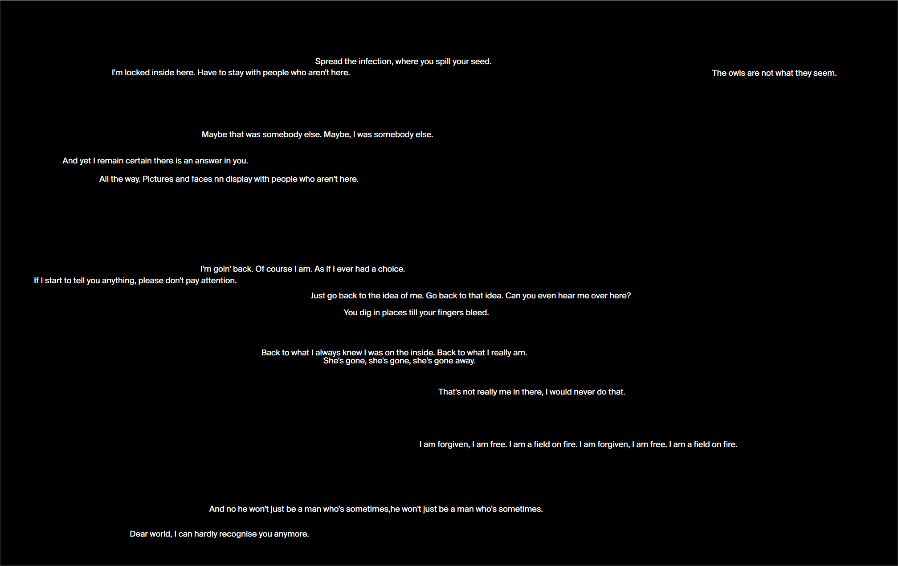

# SheHasGoneAwayWebsite
*SheHasGoneAwayWebsite* has been developed for the *She has gone away* project. The website link can be found in a book designed for the same project. The book includes also a link to a folder containing the images that should be uploaded by the user in the website to extract audio files from them. Each audio file is a segment of a song.
 
*SheHasGoneAwayWebsite* randomly arranges Div elements and the user is invited to underline the white rectangles in order to discover the words underneath. One of the rectangle is actually the button to upload an image.

